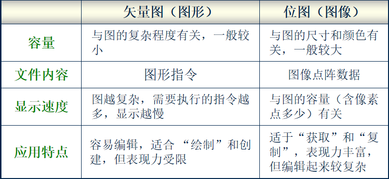
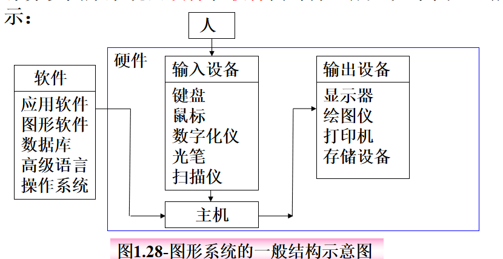
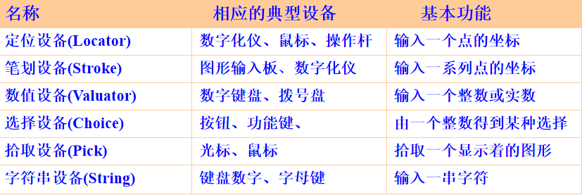
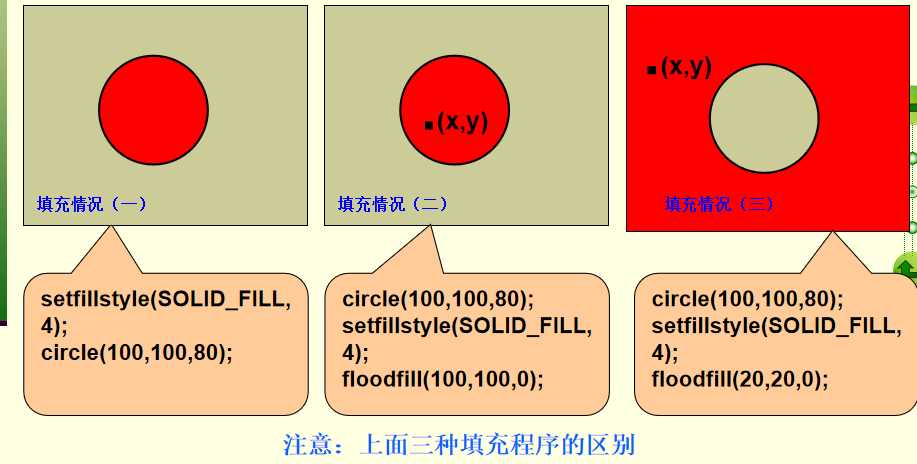
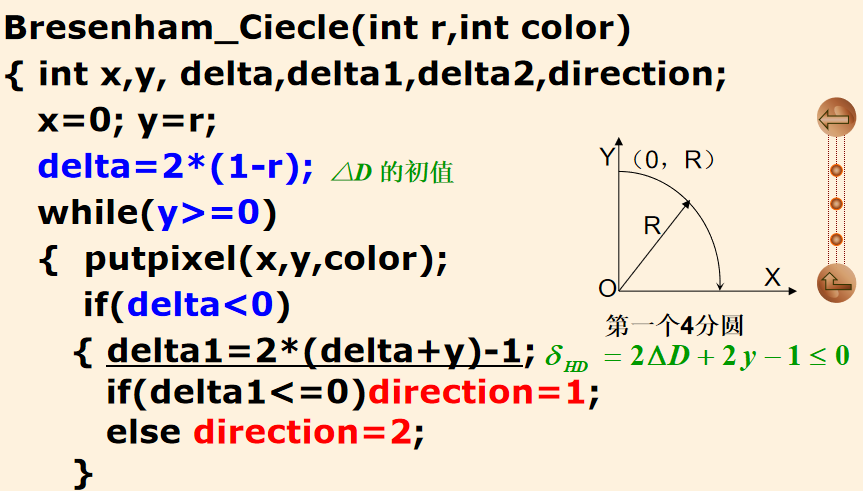
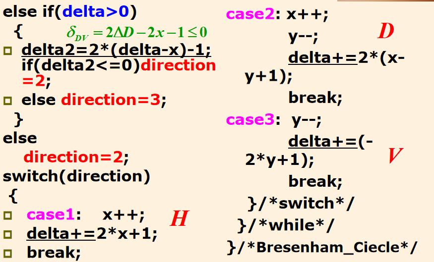
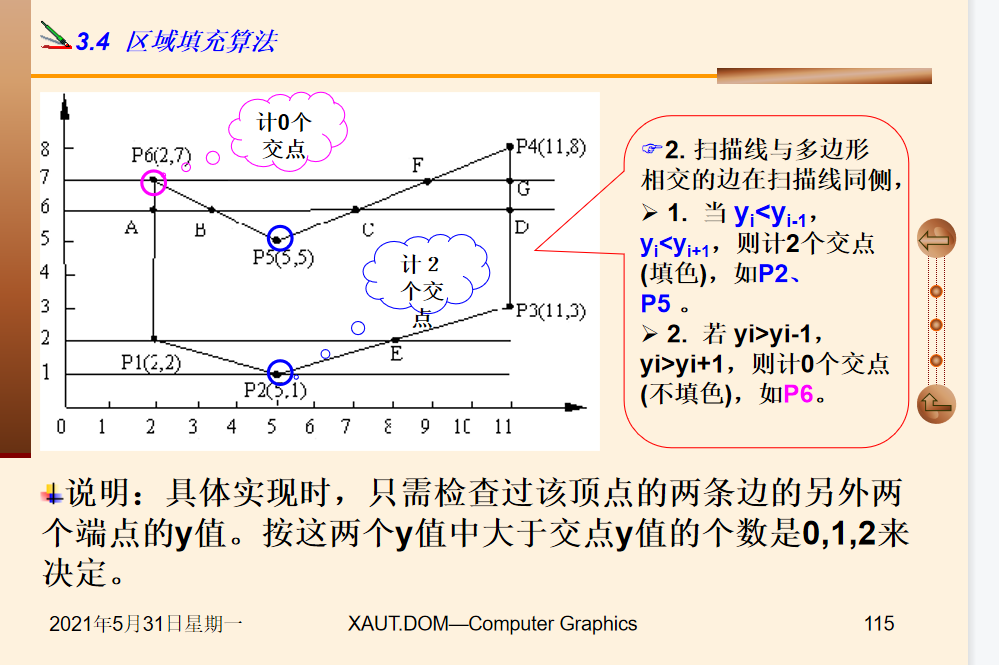
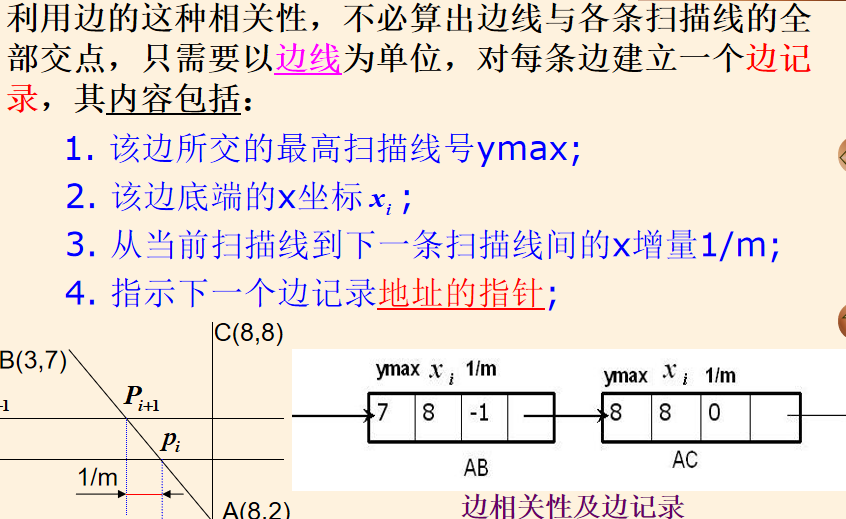
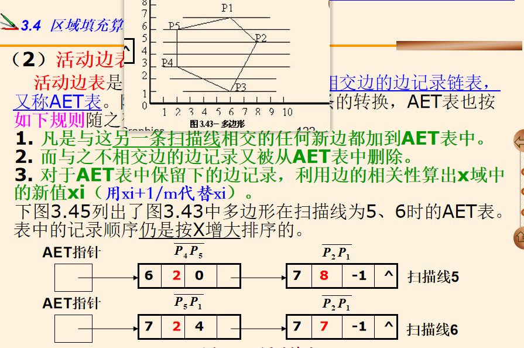

# 计算机图形学复习

## 第一章

### 什么是计算机图形学，图形与图像的概念和区别，图形的分类与属性

研究计算机绘图的一门学科

图形和图像信息易于交流和理解

图形和图像的信息更加精炼和精确

图形和图像的表达更加直观


**图形**矢量图

图元对象的集合（图元就是最简单的图形，如点、线、面、直线、曲线）几何元素和非几何元素组成

几何元素就是点线面，非几何元素就是材质的明暗、灰度、色彩等

**图像**点位图

是指由摄像机或相机等输入设备捕捉的实际场景产生的数字图像，最小可循地址称作像素

图像被分割为一个个离散的点，简称位图



### 计算机图形学的研究内容；计算机图形学软件的几种类型；图形软件的标准化；ISO发布的几个图形标准

利用计算机研究图形的表示、生成、处理、显示的学科

**计算机图形学软件的三种类型**

1.用现有的某种高级语言写成的子程序包（合理使用生命周期长，易操作）

2. 将某种高级语言的功能进行扩充，使其具有图形的生成和处理等功能（性能好但工作量大难以移植）

3. 专用的图形系统（性能好、工作量大、难以移植）

   **图形的标准化**

   一种通用的与设备无关的图形软件；主要考虑到程序的可移植性，在任意设备上只要和这个图形软件系统做一个接口，就能进行图形程序的编写。

   ISO发布的图形标准

   CGI、CGM、GKS、PHIGS 

   ### 计算机图形系统的结构、基本功能和硬件性能要求；计算机图形系统的分类。

   

   

一个计算机图形系统至少包括五点 计算、存储、输入、输出、对话


计算机图形系统的分类  脱机（通过中间载体传递给输出设备进行输出）联机（没有中间过程，但是绘图时机械速度、计算机需要等待绘制完成）、交互式（边生成、边显示、边修改）

CRT主要组成部分：金属阴极、控制栅（聚焦系统）、加速电极、偏转系统、荧光屏

CRT类型：存储管式显示器、随机扫描显示器、光栅扫描器（指标：显示颜色的种数、分辨率的高低）

光栅扫描显示器主要由五个部分组成：显示存储器、图像生成器、彩色表、CRT控制器、CRT监视器

一个阴极射线再水平和垂直方向单位长度上能识别出来的最大光点数称之为分辨率；也叫做像素

相同尺寸的屏幕点数越多，距离越小分辨率越高

主要性能参数有：显示分辨率、颜色或亮度等级数目、画图速度、刷新频率、纵横比、余辉长度、点距、显示速度、帧缓冲存储器等。

## 第二章

### 屏幕设置

 图形驱动程序
   对于不同的图形显示器，其控制方式各有差异，因此要显示图形就需要先装入相应的图形驱动程序


由于每种图形显示器都有几种不同的图形显示模式，所以要显示图形，**不但要先装入相应的驱动程序，而且还要决定所用的显示模式**

void  far detectgraph(int *gdriver,int *gmode );
[功能]  在计算机有图形适配器的情况下，确定图形适配器　　的类型；
[说明]  1.若系统有图形适配器，则把gdriver指的变量设置为适合于适配器的图形驱动程序的代码，并把gmode所指的变量设置为适配器所能支持的最高分辨率。2.若系统无图形适配器,则gdriver所指的变量为-2 


已知图形驱动程序和图形显示模式   **initgraph（gdriver，gmode，path）**   设置图形驱动程序和显示模式


未知图形驱动程序和显示模式    **detectgraph（gdriver，gmode）**  有图形驱动程序则自己会设置最适合的和最高的分辨率   设置好之后再通过   **initgraph（）** 函数来完成图形初始化      没有的话gdriver反回-2；


自动初始化图形系统  即规定 **gdriver =DETECT**  自动搜索最适合的图形驱动程序和最高的分辨率

```C++
moveto(x,y)//把光标移动到指定位置
moverel(x,y)//把光标从当前位置增量式移动+x，+y
line(x1,y1，x2，y2)//从x1，y1画一条线到x2，y2
linerel(x,y)//从当前位置增量式画一条直线x，y    注意：会改变光标的位置
```

cleardevice（）清除屏幕   clearviewport（）清楚当前窗口（设置的要显示的窗口）清楚窗口后可以重设要显示的窗口

### 图形颜色设置

setbkcolor()//背景色setcolor()//画笔颜色getmaxcolor（）//最大有效颜色值 getbkcolor  getcloor//当前颜色

putpixel//x，y处画一个规定颜色的点   getpixel//读取x，y处的点 

### 线的特性设置和填充

setlinestyle   （int linestyle  ，unsigned pattern，int width）

第一个参数：线的类型 SOLID_LINE实现、、、

第二个参数：自定义线的类型时才需要使用，否则可以设置0

第三个参数：宽度，线的粗细

图形填充：   若没有设置填充模式和颜色 ，使用的时默认填充模式和颜色一般是白色；默认填充模式是SOLID_FILL

setfillstyle（int pattern，int color）填充模式 和  颜色

先设定好填充模式再进行画图

floodfill（int  x，int y，border）x，y	是待填充的起点，border是填充区域边界的颜色


### 图形模式下文本处理

outtext（char* str）//把一个字符串输入到当前光标位置   如果当前方向是水平的 则光标移动量为该字符串的长度否则光标位置不变。

outtextxy（int x ，int y，char* str）//指定位置输出一个字符串

> sprintf(str,格式字符串，变量列表)

char str [80];

​          sprintf(str,“%s%d%c”,“one”,2,3);

​          outtextxy(10,10,str);

### 图像存取处理

图形存取限制再64kb字节以内    超过这个范围就会返回-1；

imagesize（int x1， int  y1，int x2，int y2）计算某段区域所需要的内存大小   字节

get'image（int x1，int y1，int x2，int y2，void* bitmap	）将指定区域内的图形拷贝到bitmap所指向的内存区域中去。**屏幕复制到内存**

putimage(int x,int y, void* bitmap,int op)//将getimage保存在内存中的图形重新返回到屏幕上

（x，y）是恢复显示图形左上角的位置  bitmap指向getimage（）保存图形的内存处    op是确定内存中的图形显示到屏幕时的显示模式

## 第三章

### 扫描转化或光栅化的定义

确定一个像素集合和颜色，将其转为图形的过程称作扫描转化或光栅化

1.确定有关像素

2.用图形的颜色或其他属性对像素进行某种写操作

扫描的主要工作就是确定一个最佳逼近图形的像素集

### 圆与椭圆的生成算法









